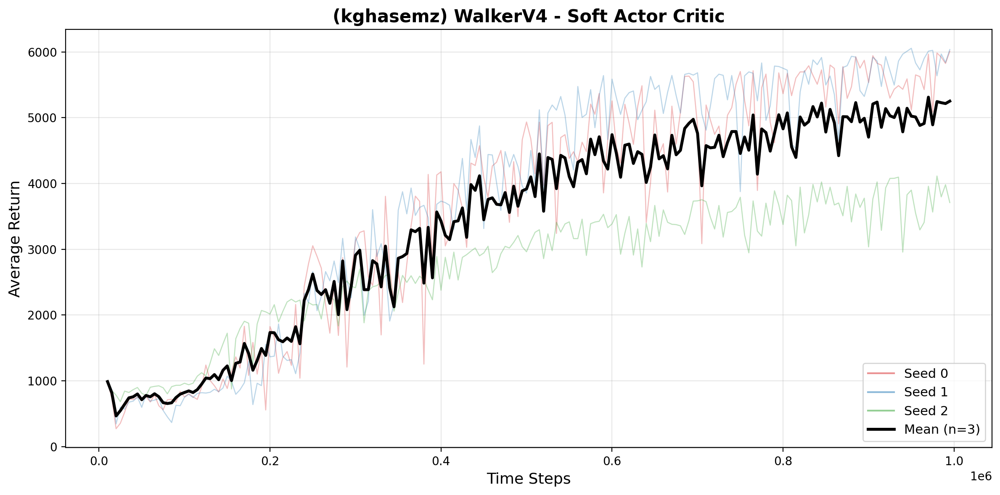
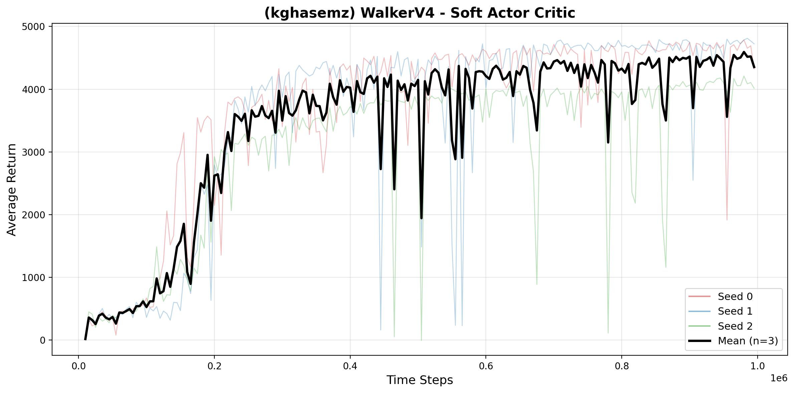

# 🤖 Soft Actor-Critic (SAC) — MuJoCo Locomotion

[](https://www.python.org/downloads/release/python-3100/)
[](https://pytorch.org/)
[](https://gymnasium.farama.org/)
[](LICENSE)

A clean, from-scratch PyTorch implementation of **Soft Actor-Critic v2** (SAC) with automatic entropy tuning, applied to continuous control tasks from MuJoCo.

> 📝 **CMPUT 628 — Deep Reinforcement Learning** | University of Alberta | Winter 2026

---
## 🎬 Trained Agents

<p align="center">
  
  

</p>

<p align="center">
  <b>Ant-v4</b>
  &nbsp;&nbsp;&nbsp;&nbsp;&nbsp;&nbsp;
  <b>Walker2d-v4</b>
  &nbsp;&nbsp;&nbsp;&nbsp;&nbsp;&nbsp;
  <b>Unitree Go1 Robot Dog</b>
</p>
---

## 📈 Results

SAC v2 achieves strong performance on both environments within 1M timesteps:

| Environment | Mean Return (last 20%) | Threshold₂₅ |
|-------------|----------------------|-------------|
| 🐜 Ant-v4 | ~5,000 | 3,500 |
| 🚶 Walker2d-v4 | ~4,300 | 3,500 |

<p align="center">
  
  
</p>

---

## 🧠 Algorithm

SAC v2 maximizes a maximum-entropy objective:

$$J(\pi) = \sum_t \mathbb{E}\Big[r_t + \alpha\,\mathcal{H}\big(\pi(\cdot|s_t)\big)\Big]$$

**Key components:**
- 🎭 **Squashed Gaussian Actor** — reparameterized sampling + tanh squashing
- 👥 **Twin Q-Critics** — clipped double-Q to reduce overestimation
- 🌡️ **Automatic Entropy Tuning** — learned α via dual gradient descent
- 🎯 **Polyak-averaged Target Networks** — soft updates with τ = 0.005

**Key implementation detail:** The default target entropy $\bar{H} = -\dim(\mathcal{A})$ is too aggressive for high-dimensional action spaces. We use $\bar{H} = -0.5 \cdot \dim(\mathcal{A})$ which significantly improves learning speed on Ant-v4 (8D actions).

---

## 🚀 Quick Start

### Installation

```bash
pip install torch gymnasium[mujoco] numpy matplotlib imageio
```

### Training

```bash
# Train on Ant-v4 (single seed)
python train_single.py --env Ant-v4 --seed 0 --total_steps 1000000 --output_dir results/ant

# Train on Walker2d-v4
python train_single.py --env Walker2d-v4 --seed 0 --total_steps 1000000 --output_dir results/walker

# Train all 3 seeds in parallel (on a cluster)
for SEED in 0 1 2; do
    python train_single.py --env Ant-v4 --seed $SEED --total_steps 1000000 --output_dir results/ant &
done
```

### Plotting

```bash
# Plot training curves (mean + individual seeds)
python plot_seeds.py --env Ant-v4 --input_dir results/ant --title "(kghasemz) AntV4 - Soft Actor Critic"
python plot_seeds.py --env Walker2d-v4 --input_dir results/walker --title "(kghasemz) WalkerV4 - Soft Actor Critic"
```

### Record Videos

```bash
export MUJOCO_GL=egl  # for headless rendering
python record_video.py --env Ant-v4 --checkpoint results/ant/sac_ant_v4_seed0.pth --episodes 3
```

---

## 🔬 Ablation Study: Hyperparameter Sensitivity

We study how **target entropy** and **target smoothing coefficient (τ)** affect SAC performance on both environments.

### Target Entropy ($\bar{H}$)

| Setting | Ant-v4 | Walker2d-v4 |
|---------|--------|-------------|
| $-d_A$ (default) | Slow early learning | ✅ Best |
| $-0.5 \cdot d_A$ | Good | Good |
| $-0.25 \cdot d_A$ | ✅ Fastest | Good |

**Key finding:** Softer targets help Ant (8D) but the default works best for Walker (6D). Sensitivity scales with action dimensionality.

### Target Smoothing (τ)

| Setting | Ant-v4 | Walker2d-v4 |
|---------|--------|-------------|
| τ = 0.0001 | Slow but stable | ❌ Too stale |
| τ = 0.001 | ✅ Best | ✅ Best |
| τ = 0.1 | ❌ Catastrophic | Works fine |

**Key finding:** τ sensitivity is environment-dependent. Complex environments (Ant) need slow target updates for stability. Simple environments (Walker) tolerate fast updates but suffer from stale ones.

### Run Ablations

```bash
# Run one ablation config
python run_ablation.py --env Ant-v4 --study ant_target_entropy \
    --param target_entropy --value -4.0 --label H4 --seeds 0 1 --total_steps 1000000

# Merge per-seed results and plot
python merge_seeds.py
python plot_ablation.py --input_dir results/ablation
```

---

## 📁 Project Structure

```
├── model.py               # GaussianPolicy + TwinQ networks
├── agent.py               # SAC v2 algorithm (train loop, losses)
├── replay_buffer.py       # Circular numpy replay buffer
├── agent_environment.py   # Environment interaction loop
├── train_single.py        # Train one seed, save .npz + .pth
├── plot_seeds.py          # Plot training curves (mean + seeds)
├── run_ablation.py        # Run one ablation config
├── merge_seeds.py         # Merge per-seed .npz into combined
├── plot_ablation.py       # Plot ablation results
├── record_video.py        # Record agent videos from checkpoint
├── results/
│   ├── ant/               # Ant-v4 training results
│   └── walker/            # Walker2d-v4 training results
└── videos/                # Recorded agent videos
```

---

## ⚙️ Hyperparameters

| Parameter | Value |
|-----------|-------|
| Learning rate (all networks) | 3 × 10⁻⁴ |
| Discount (γ) | 0.99 |
| Soft update (τ) | 0.005 |
| Batch size | 256 |
| Replay buffer | 10⁶ |
| Warmup steps | 10,000 |
| Initial α | 0.2 |
| Target entropy | -0.5 × dim(A) |
| Hidden layers | 2 × 256 (ReLU) |
| Reward scale | 1.0 |

---

## 📚 References

- Haarnoja et al., [Soft Actor-Critic: Off-Policy Maximum Entropy Deep Reinforcement Learning with a Stochastic Actor](https://arxiv.org/abs/1801.01290), ICML 2018
- [adi3e08/SAC](https://github.com/adi3e08/SAC) — PyTorch implementation reference
- [alirezakazemipour/SAC](https://github.com/alirezakazemipour/SAC) — Implementation reference

---

## 📄 License

MIT License. See [LICENSE](LICENSE) for details.
